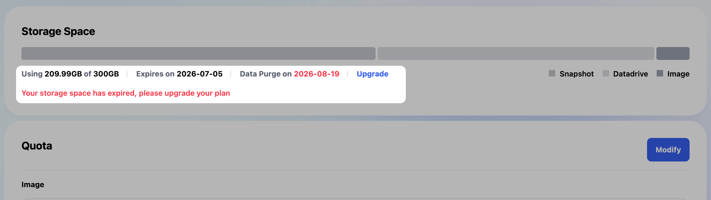
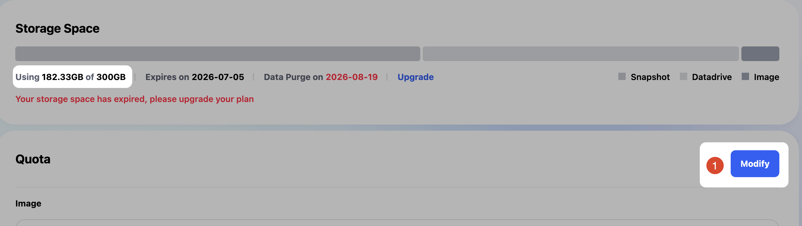
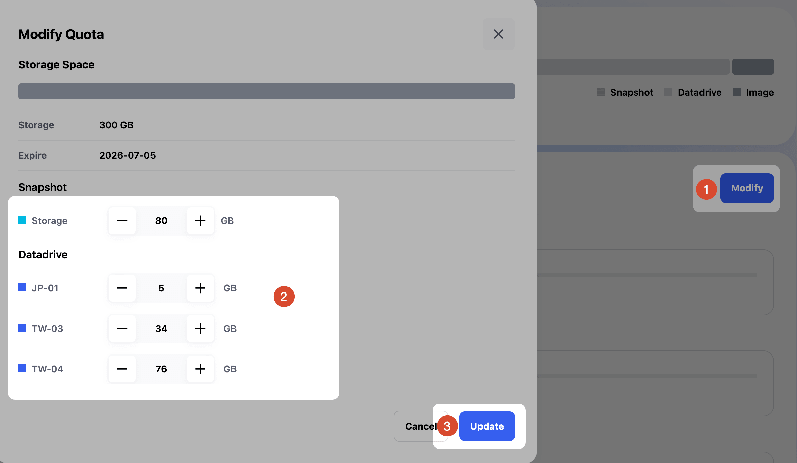
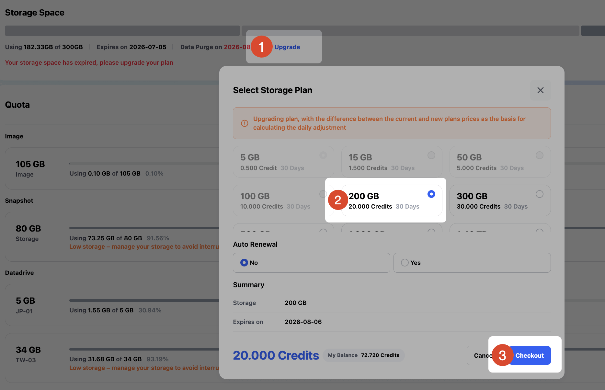
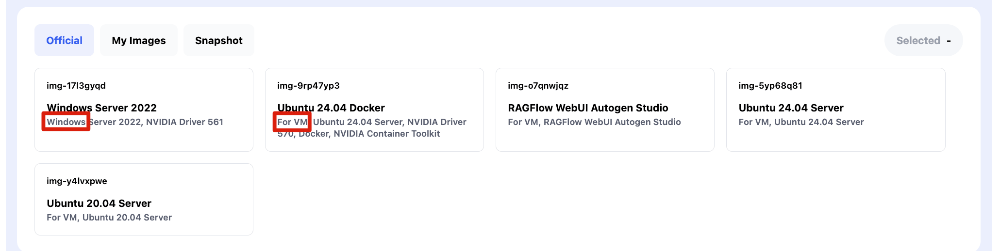
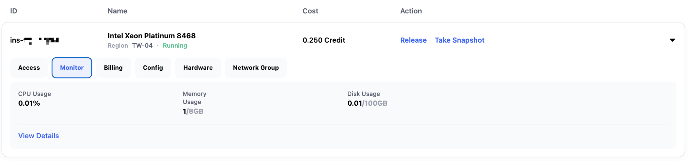
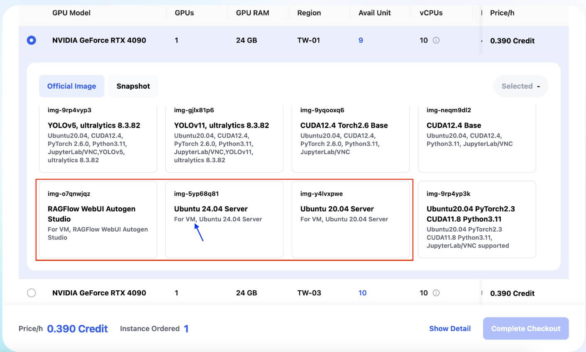

# Glows.ai GPU レンタルプラットフォーム FAQ

このページでは、Glows.ai GPU レンタルプラットフォームに関するよくある質問をまとめています。データ保存、インスタンス環境、接続方法、自動デプロイ、課金、サービス保証などについて説明します。追加のサポートが必要な場合は、公式サポート窓口までお問い合わせください。

## DataDrive と Snapshot によるデータ管理

### 1. インスタンスを解放して計算料金を停止し、ストレージ料金だけを残すことはできますか？

はい。トレーニングや推論を実行していない場合は、インスタンス（Instance）を解放することで GPU 計算リソースの課金を停止できます。必要なデータや環境は DataDrive と Snapshot で保持できます。

- モデル、データセット、コードなどのデータファイルは DataDrive に保存することをおすすめします。DataDrive は、インスタンスを起動していない状態でもアップロードとダウンロードに対応しています。
- Python パッケージ、システムソフトウェア、環境設定など、次回も利用したい環境変更は、インスタンスを解放する前に `Take Snapshot` をクリックして環境スナップショットとして保存してください。
- Snapshot は DataDrive 以外のインスタンス内部の変更を保存します。Snapshot が小さいほど、後から新しいインスタンスを作成する際に通常は速くなります。

DataDrive と Snapshot を利用するには、Storage Space ページでストレージプランを購入する必要があります。DataDrive と Snapshot の容量は、実際の利用状況に応じて配分できます。

### 2. DataDrive にアップロードしたファイルはどこで確認できますか？

インスタンス作成時に DataDrive をマウントしてください。インスタンスにログインすると、`/datadrive` ディレクトリでファイルを確認できます。

```bash
ls /datadrive
```

### 3. 複数のインスタンスで同じ DataDrive を共有できますか？

はい。同じリージョン内のインスタンスであれば、同じ DataDrive をマウントしてデータを共有できます。本番利用の前にテスト用インスタンスを作成し、イメージ環境、パス、権限がワークフローに合っているか確認することをおすすめします。

### 4. インスタンスの解放後、またはレンタル期間終了後、インスタンスディスク上のデータは削除されますか？

はい。インスタンスディスクは、インスタンスが稼働している間のみ有効です。インスタンスを解放すると、インスタンスディスク上のデータは削除されます。

重要なデータは DataDrive に保存することをおすすめします。環境やインストール済みソフトウェアを保持したい場合は、インスタンスを解放する前に Snapshot を作成してください。プラットフォームのストレージを利用しない場合は、解放前に `scp` などでローカル環境へダウンロードすることもできます。

### 5. ストレージプランの期限が切れると、DataDrive と Snapshot は自動的に削除されますか？

すぐに自動削除されることはありません。DataDrive と Snapshot はストレージプランで管理されます。プラン期限切れ後もデータは一定期間復旧可能な状態で保持される場合がありますが、通常利用を継続するには更新が必要です。作業への影響を避けるため、期限前の更新をおすすめします。

### 6. DataDrive をマウントしたインスタンスを再起動した後、`/datadrive` が消えました。データは失われていますか？

いいえ。インスタンスの再起動によって DataDrive のデータが失われることはありません。再起動後に自動マウントされない場合は、インスタンス内で次のコマンドを実行して手動マウントをお試しください。

```bash
sudo mount -t virtiofs DataDrive /datadrive
```

この状況は、再起動時に自動マウントが実行されなかった場合に発生することがあります。プラットフォーム側でも継続的に改善していきます。

### 7. Snapshot を効率よく使うにはどうすればよいですか？

Snapshot はインスタンスディスク上の変更を保存します。環境、パッケージ、システム設定はインスタンスディスクに保持し、データセット、モデル重み、コードは DataDrive に保存することをおすすめします。これにより Snapshot のサイズを小さくでき、Snapshot から新しいインスタンスを作成する速度も向上しやすくなります。

リージョンをまたいで Snapshot を利用する場合、インスタンス作成速度は Snapshot サイズやネットワーク転送状況の影響を受けます。そのため、Snapshot はできるだけ軽量に保つことをおすすめします。

### 8. DataDrive の Web 版でフォルダをまとめてアップロードできますか？

現在、DataDrive の Web 版は主に単一ファイルのアップロードに対応しています。フォルダをアップロードする場合は、先に 1 つの圧縮ファイルにまとめるか、DataDrive PC 版をご利用ください。

DataDrive PC 版のダウンロード：[https://glows.ai/datadrive](https://glows.ai/datadrive)

### 9. DataDrive の Web 版で大容量ファイルのアップロードに失敗した場合はどうすればよいですか？

DataDrive PC 版の利用をおすすめします。PC 版は Windows と macOS に対応しており、大容量ファイルやフォルダのアップロード、ダウンロードに適しています。

ダウンロード：[https://glows.ai/datadrive](https://glows.ai/datadrive)

### 10. 異なるリージョン間で DataDrive のデータを直接同期できますか？

現在、リージョンをまたいだ DataDrive の直接同期には対応していません。TW-01 から TW-02 にデータを移動する場合は、いったんローカルにダウンロードしてから、移行先リージョンの DataDrive にアップロードしてください。

### 11. Snapshot はエクスポートできますか？

いいえ。Snapshot は Glows.ai プラットフォーム内部で利用する形式であり、現在は直接エクスポートに対応していません。

### 12. インスタンスを起動せずにデータをアップロードまたはダウンロードできますか？

はい。DataDrive は、GPU インスタンスを起動していない状態でもアップロードとダウンロードに対応しています。

- DataDrive チュートリアル：[Datadrive](https://www.youtube.com/watch?v=_MtYfNKQ3xA)
- DataDrive PC 版：[Download](https://glows.ai/datadrive)

### 13. 起動済みの VM に DataDrive を追加またはマウントできますか？

現在は対応していません。DataDrive はインスタンス作成時に選択してください。

### 14. DataDrive を空にしたのに、Storage ページでは使用容量が残っているのはなぜですか？

DataDrive 画面でデータを削除した後、Storage ページへの反映には通常 5-10 分ほどかかります。実際の使用量を確認するには、同じリージョンでインスタンスを作成し、DataDrive をマウントしたうえで次のコマンドを実行してください。

```bash
# 総ストレージ使用量を確認
df -h | grep datadrive

# /datadrive 配下のファイルとフォルダを確認
ls -alh /datadrive
```

Ubuntu のファイルシステムでは、削除した一部のファイルが一時的に `/datadrive/.Trash-0` に移動される場合があります。不要であることを確認したうえで、次のコマンドで完全に削除できます。

```bash
# この操作は元に戻せません。パスを確認してから実行してください。
rm -rf /datadrive/.Trash-0
```

### 15. DataDrive への書き込み時に `Disk quota exceeded` と表示されるのはなぜですか？

このエラーは通常、ストレージ容量が不足していることを示します。主な原因は次のとおりです。

1. DataDrive の容量を使い切っています。不要なファイルを削除するか、Storage ページで容量を拡張してください。
2. Storage プランの期限が切れています。更新後に引き続き利用できます。

### 16. Storage の更新時に下位プランへ変更するにはどうすればよいですか？

大きい容量のプランから小さい容量のプランへ変更する場合は、まず現在の実使用量が変更先プランの容量を下回っている必要があります。

たとえば現在のプランが 300GB で、200GB プランに更新したい場合は、DataDrive、Snapshot、Images の不要なファイルを削除し、実使用量を 200GB 未満にしてください。



削除後、使用量が変更先プランの容量を下回っていることを確認します。



`Modify` をクリックし、割り当て済みの総容量を変更先プランの容量以下に調整してから `Update` をクリックします。



その後 `Upgrade` をクリックすると、より小さい容量のプランを選択できます。



### 17. `.partial` という拡張子は何を意味しますか？

`.partial` は、アップロード中にシステムが生成する一時ファイルです。アップロード完了後に自動的に消え、通常の利用には影響しません。

## イメージとストレージ管理

### 1. カスタム Docker イメージをアップロードするにはどうすればよいですか？

公式ガイドを参照してください：[Upload Custom Docker Image](https://docs.glows.ai/docs/upload-custom-docker-image)

### 2. Image ファイルが大きい、ネットワークが不安定、またはページを切り替えてアップロードが中断された場合はどうなりますか？

プラットフォームはレジュームアップロードに対応しています。アップロードが中断されても、最初からやり直す必要はなく、中断した位置から再開できます。

### 3. ローカルのモデルや Python コードを Glows.ai インスタンスに転送するにはどうすればよいですか？

まず DataDrive の利用をおすすめします。

1. ローカルファイルを DataDrive にアップロードします。
2. インスタンス作成時に DataDrive をマウントします。
3. インスタンスにログインし、`/datadrive` ディレクトリからファイルを読み込みます。

インスタンスがすでに起動している場合は、`scp` でも転送できます。以下は Windows ローカル環境からインスタンスの `/home` へ転送する例です。

```bash
scp -P 23675 -r C:\Users\Data root@tw-03.access.glows.ai:/home
```

各インスタンスの SSH 接続アドレスとポートは異なる場合があります。インスタンスページに表示される情報を使用してください。

### 4. Glows.ai の Snapshot 機能は、インストール済みプログラムやデータを保存しますか？

はい。Snapshot は作成時点のインスタンス内部のファイル、設定、インストール済みソフトウェア、構成内容を保存します。ただし DataDrive 内のデータは含まれません。DataDrive のデータはクラウド上に保存されているため、Snapshot に重複して保存する必要はありません。

## イメージとアプリケーション操作

### 1. FramePack などで生成した動画をダウンロードできない場合はどうすればよいですか？

まずインスタンスが解放されていないことを確認し、JupyterLab から手動でダウンロードしてください。

1. 対象インスタンスの JupyterLab を開きます。
2. `/FramePack/outputs/` に移動します。
3. 生成された `.mp4` ファイルを探します。
4. ファイルを右クリックし、`Download` を選択します。

それでもダウンロードできない場合は、スクリーンショットを添えてプラットフォームの技術サポートへお問い合わせください。

### 2. ComfyUI でワークフローを読み込んだ際、カスタムノード不足で利用できない場合はどうすればよいですか？

インスタンスを作成してワークフローを読み込み、エラー画面または不足しているノードのメッセージを共有してください。技術サポートが、必要なカスタムノードや依存パッケージの確認をサポートします。

### 3. ComfyUI で WAN 2.1 をテストした際に Model 不足の警告が表示されるのはなぜですか？

通常はモデルが正しく読み込まれていないことを示します。モデルファイルの場所、ワークフロー設定、モデル名が正しいか確認してください。解決しない場合は、エラーのスクリーンショットを共有してください。

## インスタンス環境、権限、接続

### 1. Docker や K8s はサポートされていますか？VM と Container の違いは何ですか？

Glows.ai は、VM と Container という 2 種類の基盤クラウドサービス形態を提供しています。

- Container インスタンスは、事前設定済みのベース環境が多く、環境構築が比較的簡単です。ただし、インスタンス内で Docker を実行したり、NVIDIA ドライバーなどの低レイヤーソフトウェアを変更したりすることはできません。
- VM インスタンスはより高い権限を提供し、カスタム GPU ドライバー、Docker、Systemctl などに対応しています。システム全体の制御が必要なワークロードに適しています。

インスタンス作成時に `Windows` または `For VM` タイプの Image を選択すると、VM インスタンスになります。



### 2. インスタンスには root 権限がありますか？

はい。インスタンスはデフォルトで root アカウントでログインします。ログイン後に別のユーザーを作成することもできます。

### 3. OS 環境を選択できますか？

現在、プラットフォームでは Ubuntu 系 OS 環境と Windows Server 2025 を提供しています。一般的な用途では Ubuntu をおすすめします。その他の OS が必要な場合は、要件評価のためお問い合わせください。

### 4. Windows 環境ではリモート操作が重い、または不安定になることがありますか？

Windows のリモートデスクトップ操作は、ネットワーク、グラフィカルインターフェース、ワークロードの影響を受ける場合があります。Windows に依存しないタスクでは、より安定したトレーニングや推論体験のため Linux 環境をおすすめします。

### 5. どのリモート接続方法がサポートされていますか？

Ubuntu インスタンスは SSH と JupyterLab に対応しています。Windows インスタンスは RDP に対応しています。まずはプラットフォームが提供する接続方法の利用をおすすめします。必要に応じて、ログイン後に別の接続ツールをインストールできます。

### 6. RDP 接続 URL の `tw-02.access.glows.ai` は、インスタンスの実際のリージョンを示していますか？

必ずしもそうではありません。接続 URL の `tw-02` はアクセスノードのコードである場合があり、実際の計算ホストのリージョンを示すものではありません。インスタンスページに表示されるデプロイ先リージョンを確認してください。

### 7. GPU/CPU 使用率、メモリ、ディスク使用量をリアルタイムで確認できますか？

はい。インスタンス作成後、インスタンスページの Monitor 機能で CPU/GPU 使用率、GPU メモリ、システムメモリ、ディスク使用量などの推移を確認できます。



### 8. NVIDIA Driver はお客様自身で更新できますか？

インスタンスタイプによって異なります。

1. Container タイプのインスタンスでは、現在 NVIDIA Driver の手動変更には対応していません。
2. VM タイプのインスタンスでは、お客様自身で Driver をダウンロードして更新できます。必要に応じて、プラットフォーム側で技術サポートを提供できます。[Contact Us](https://docs.glows.ai/docs/contact-us)



## 自動デプロイ、ネットワーク、エンタープライズ機能

### 1. 自動スケーリングはサポートされていますか？

はい。プラットフォームは Autodeploy 機能を提供しています。リクエストを受け取ると自動的にインスタンスを作成し、サービスを起動し、アイドル状態になった後にインスタンスを解放できます。

一般的な流れは次のとおりです。

1. お客様が Autodeploy リンクにリクエストを送信します。
2. Glows.ai のバックエンドが設定に基づいてインスタンスを作成します。
3. 設定された Service Start Command を実行します。
4. リクエストを設定済みのサービスポートへ転送します。
5. 処理結果を返します。
6. n 分間新しいリクエストがない場合、プラットフォームが自動的にインスタンスを解放します。

また、Glows.ai SDK を利用して、プログラムからインスタンスの起動と解放を制御することもできます。
Autodeploy 使用ガイド：[Autodeploy](https://docs.glows.ai/docs/auto-deploy-usage)
SDK 使用ガイド：[SDK Docs](https://sdkdoc.glows.ai)

### 2. CLI または API による自動デプロイは提供されていますか？

API による自動デプロイが必要なエンタープライズのお客様は、評価のためお問い合わせください。SDK 使用ガイド：[SDK Docs](https://sdkdoc.glows.ai)

### 3. アイドル費用を避けるため、API でマシンを起動・停止できますか？

API 機能は現在、主に自動化ニーズのあるエンタープライズのお客様向けに提供されています。利用をご希望の場合は、公式サポート窓口までお問い合わせください。

### 4. ネットワーク転送料は課金されますか？固定帯域や固定 IP は提供されていますか？

通常、データ転送量に対する個別課金はありません。固定 1Gbps 帯域、静的 IP などの高度なネットワーク機能が必要な場合は、追加オプションとして申請できます。営業および技術チームが要件を確認したうえで有効化します。

### 5. インスタンスを停止または再起動すると IP/DNS は変わりますか？

変わる場合があります。より安定したサービス入口が必要な場合は、Autodeploy の固定サービスリンクを利用し、お客様側でトラフィック分散戦略を設計することをおすすめします。

### 6. 企業のプライベートネットワークや VPN によるアクセス制限は利用できますか？

この機能は現在開発および計画中です。将来的には、エンタープライズのお客様がインスタンスへのアクセスを許可するネットワーク IP を設定し、特定の VPN セグメントからのみ SSH アクセスを許可できるようになる予定です。正式な提供時期はプラットフォームのお知らせをご確認ください。

### 7. 既存のサーバーや GPU マシンを Glows.ai に統合できますか？

ハイブリッドクラウドまたはプライベートクラウド構成として、本地の CPU/GPU マシンを計算リソースプールの一部として統合できるか評価できます。実現可否は、ハードウェア、ネットワーク、デプロイ要件に基づき技術チームが確認します。

ご希望の場合はお問い合わせください：[Contact Us](https://docs.glows.ai/docs/contact-us)

### 8. プライベートクラウドでは CPU マシンも統合管理できますか？

はい。プライベートクラウド構成では、本地の非 GPU マシンを統合し、統一管理とスケジューリングを提供できます。具体的な構成はプロジェクト評価が必要です。

## GPU リソースと基盤サポート

### 1. H100/H200 GPU は NVIDIA MIG 分割に対応していますか？

Glows.ai に導入されている H100/H200 GPU は NVIDIA MIG 機能に対応しています。実際の提供方法と設定は、製品プランおよびリソース状況によって異なります。

### 2. GPU はすべて 1 枚単位でのレンタルですか？

現在、プラットフォームでは主に GPU 1 枚単位でのレンタルを提供しています。

### 3. GPU 間で NCCL 通信はサポートされていますか？

はい。NCCL は分散トレーニングや複数 GPU 間のデータ同期に利用できます。

## アカウント、課金、チャージ

### 1. Gmail ではなく通常の Email で登録できますか？

現在、システムはデフォルトで Gmail 登録に対応しています。通常の Email アドレスでアカウント作成が必要な場合は、技術または営業チームまでお問い合わせください。要件を確認したうえで対応を検討します。

### 2. オンラインチャージの最低金額はありますか？

はい。オンラインチャージの最低金額は 10 米ドルで、10 米ドル単位でのチャージとなります。

### 3. チャージを忘れてクレジットがなくなった場合はどうなりますか？

クレジットがなくなると、システムは稼働中のインスタンスに対して自動的に Snapshot を作成し、インスタンスを停止します。再チャージ後、自動生成された Snapshot から環境を復元できます。

### 4. 最低利用時間はありますか？

ありません。プラットフォームは pay-as-you-go の従量課金方式です。利用した分だけお支払いいただきます。インスタンスが稼働していない間は GPU 計算料金は発生せず、実際の利用状況に応じたストレージ料金のみが発生します。

### 5. H200 GPU の料金はいくらですか？

H200 GPU の従量課金料金は、プラットフォーム上の表示をご確認ください。長期利用または月額利用をご希望の場合は、割引プランについてお問い合わせください。

### 6. ストレージ料金はどのように計算されますか？

ストレージはプランまたは使用量に応じて課金されます。最新料金は Storage ページをご確認ください。大量購入またはエンタープライズ要件がある場合は、お問い合わせください。

### 7. 大量利用または長期利用の割引はありますか？

はい。大量利用または長期利用をご希望の場合はお問い合わせください：[Contact Us](https://docs.glows.ai/docs/contact-us)

### 8. 利用前にサブスクリプション費、設定費、最低利用料金は必要ですか？

いいえ。一般的な利用では、サブスクリプション費、設定費、最低利用料金はありません。

### 9. ソフトウェアまたはプラットフォーム提携のお客様はどのように課金されますか？

利用量、ストレージ量、提携形態に基づいて料金プランを評価できます。代理販売、再販売、プラットフォーム提携などの場合は、営業チームまでお問い合わせください。

## サービス保証と補償

### 1. SLA は提供されていますか？

はい。現在、プラットフォームでは主にハードウェアサービスとストレージサービスに対してサービスレベルのコミットメントを提供しています。

- コアハードウェアサービス：99% の可用性。
- DataDrive ストレージサービス：99.9% の可用性。

具体的な条件は正式なサービス契約に準じます。

### 2. サービス障害が発生した場合、冗長化や補償はありますか？

ハードウェアまたはプラットフォーム側の問題によりレンタル中のインスタンスが利用できなくなった場合、障害時間と原因をできるだけ早く確認し、サービスとデータの復旧を優先し、状況に応じて補償を行います。

基本補償の目安：

- 障害 1-3 時間：6 時間分を補償。
- 障害 6-12 時間：12 時間分を補償。

障害によりデータ損失や復旧不能なタスク中断など重大な影響が発生した場合、プラットフォームは具体的な状況に応じて個別に評価します。物理ディスク障害などの特殊な場合を除き、保存済みデータが失われることは通常ありません。重要なデータは DataDrive に保存することを強くおすすめします。
